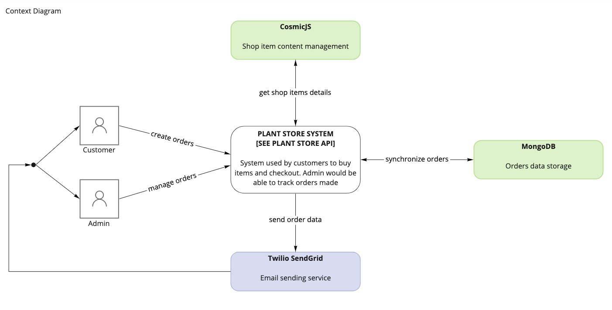
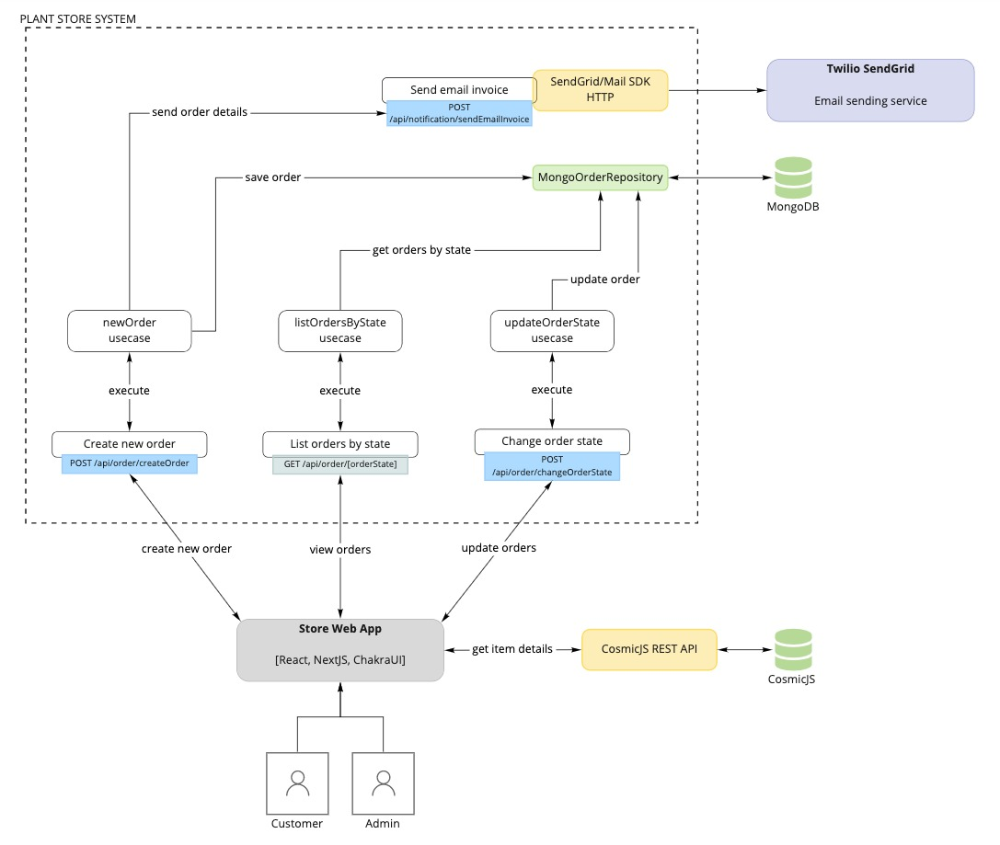
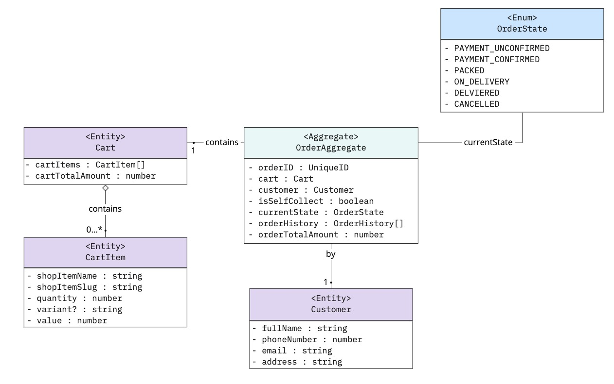
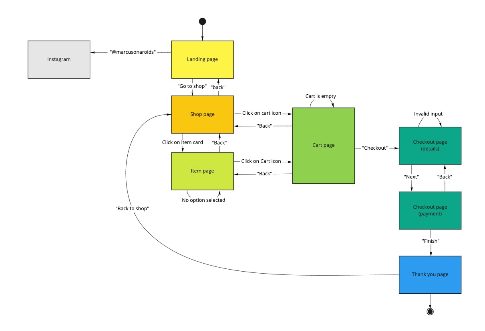
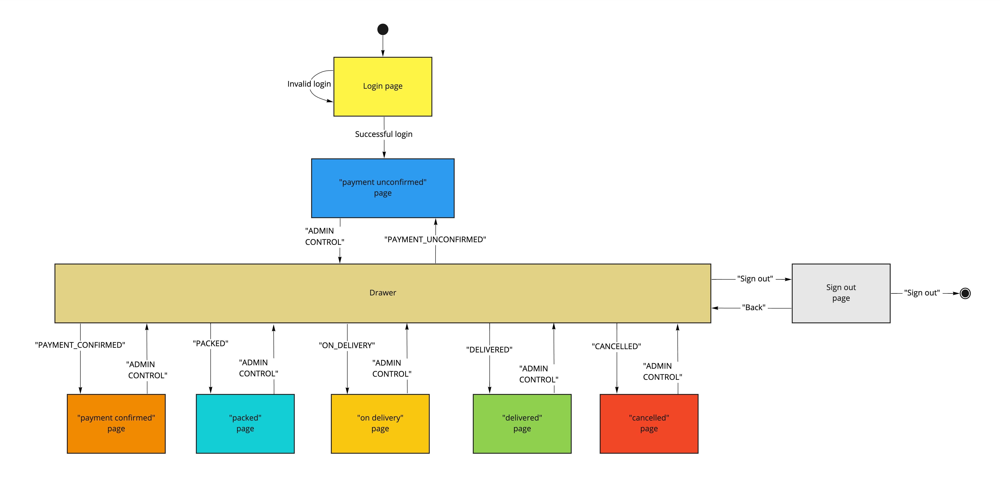

# The Aroid House Official Site

<p>
  

  

  

  

  

  
</p>

Repository for official site of TheAroidHouse. Built for [@marcusonaroids](https://www.instagram.com/marcusonaroids/).

[Click here to visit the site](https://the-aroid-house-official-site.vercel.app)

## Demo

INSERT DEMO GIF HERE

## Tech Stack

**Client:** NextJs, ChakraUI

**Server:** NextJs API routes, Vercel

**Content Management:** CosmicJS

**Database:** MongoDB

## Run Locally

Clone the project

```bash
  git clone https://github.com/DanKarDev/the-aroid-house-official-site
```

Go to the project directory

```bash
  cd the-aroid-house-official-site
```

Install dependencies

```bash
  npm install
```

Start the server

```bash
  npm run dev
```

## Deployment

3 step process to deploying the site properly on vercel

1. Fork this repository into your own GitHub account.
2. Using vercel, deploy the repository. [Learn how to deploy on vercel](https://vercel.com/docs/introduction)
3. Put in the following enviornment variables. [Learn how to add env variables on vercel](https://vercel.com/docs/environment-variables)

```bash
# for logging into /admin to see all orders
  USERNAMES
  PASSWORDS
  ADMIN_EMAIL
  NEXTAUTH_URL

# for storing orders
  MONGODB_URI
  MONGODB_DB

# for email invoice sending to customer
  SENDGRID_API_KEY
```

## Documentation

### Folder Structure
```
the-aroid-house-official-site/
┣━━📁 documentation       # assets for README.md
┣━━📁 domain              # we are following domain driven design approach
┃ ┣━━📁 application
┃ ┃ ┗━━📁 order
┃ ┣━━📁 infrastructure
┃ ┃ ┗━━ MongoOrderRepository.tsx
┃ ┗━━📁 models
┃   ┣━━📁 aggregates
┃   ┣━━📁 entities
┃   ┗━━📁 infrastructure
┣━━📁 public              # public assets, favicon, SEO head images
┣━━📁 src
┃ ┣━━📁 components
┃ ┃ ┣━━📁 admin
┃ ┃ ┣━━📁 buttons
┃ ┃ ┣━━📁 cards
┃ ┃ ┣━━📁 cart
┃ ┃ ┣━━📁 checkout
┃ ┃ ┣━━📁 item
┃ ┃ ┣━━📁 layout
┃ ┃ ┣━━ Landing.js
┃ ┃ ┣━━ NotFoundAnimation.js
┃ ┃ ┣━━ ShopItems.js
┃ ┃ ┗━━ ThankyouAnimation.js
┃ ┣━━📁 context
┃ ┃ ┣━━ CartContext.js
┃ ┃ ┗━━ PaymentContext.js
┃ ┣━━📁 libs               # MongoDB connector
┃ ┃ ┗━━ mongodb.ts
┃ ┣━━📁 pages
┃ ┃ ┣━━📁 admin
┃ ┃ ┣━━📁 api              # serverless functions
┃ ┃ ┣━━📁 shop
┃ ┃ ┣━━ 404.js
┃ ┃ ┣━━ _app.js
┃ ┃ ┣━━ _document.js
┃ ┃ ┣━━ cart.js
┃ ┃ ┣━━ checkout.js
┃ ┃ ┣━━ index.js           # main page
┃ ┃ ┗━━ thankyou.js
┃ ┗━━ theme.js
┣━━ .env.local
┣━━ .gitignore
┣━━ README.md
┣━━ config.js
┣━━ next-env.d.ts
┣━━ next.config.js
┣━━ package-lock.json
┣━━ package.json
┗━━ tsconfig.json
```

### Diagrams

[We are following the C4 model for visualising software architecture](https://c4model.com/)

#### Context Diagram



#### Container + Component Diagram



#### Code Diagram



#### UI Prototype

We did our prototype using figma
[Click here to view](https://www.figma.com/file/R7p55i68xrq2K7SGj1yG3C/TheAroidHouse)

Took inspiration from [Dmitry Lauretsky](https://dribbble.com/shots/15415849-Vera-Plant-Growing-App-Redesign/attachments/7182810?mode=media)

Animations from [LottieFiles](https://lottiefiles.com/)

#### Dialog maps

##### Main site



##### Admin site



#### Instructions

[User purchase instructions](https://www.figma.com/file/oI7ZEa1MMACvtPT0WHeP53/TheAroidHouse-purchase-instructions)

[Admin instructions](https://www.figma.com/file/qryInjAH5rp1DlfRiY7JF3/TheAroidHouse-admin-instructions)

### Design Decisions

Major driving factor of our decision is cost. We need to keep cost as close to zero as possible. For to that cost driving factor, we have decided to go with

#### UI Library

We considered two. ChakraUI and TailwindCSS.

TailwindCSS definitely gives better customizability over ChakraUI but the initial learning curve is steep for us. Our team is well versed with ChakraUI but no experience with TailwindCSS. For that reason, we decided to go with CharaUI for this project. We will try out TaildwindCSS for next project.

#### Web Framework

NextJS. Our team is well versed in NextJS and we have little to zero developer friction/initial learning curve time is reduced. Time to delivery reduced.

Also NextJS is built upon React framework. We could make use of multitute of community desigend components.

#### Hosting

Vercel hobby plan has generous limits. 100GB of bandwith per month. If the site grows too big then will have to migrate over to the team plan. [See vercel plans pricing here.](https://vercel.com/pricing)

#### Content Management

We considered two. Strapi and CosmicJS.

Strapi gives user and developers more flexibility and customizability. One big con is that it has to be self hosted.

CosmicJS gives user easier to use dashboard (compared to Strapi) to manage content. We decided to go with CosmicJS as it has generous limits. 10,000 API requests per month. It is also a managed service. [See CosmicJS pricing here.](https://www.cosmicjs.com/pricing)

#### Datastore/Database

We initially wanted to use firebase firestore. We found it hard to integrate with NextJS/Vercel serverless functions and thus went with MongoDB free tier M0 shared cluster.

We lose the ability to have realtime update of data which is not required in our current system. [See MongoDB pricing here.](https://www.mongodb.com/pricing)

## Authors

- [@YingSheng](https://yeowys.com)
- [@OkkarMin](https://okkarm.in)
